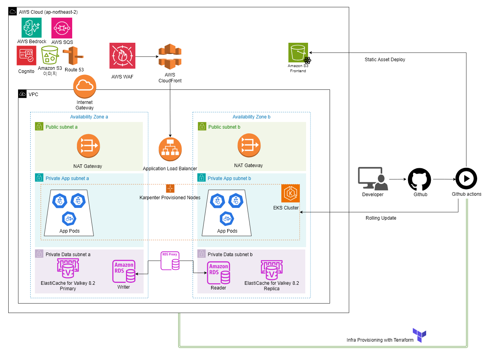

# 책 먹는 사자 (Book Eating Lion)

도서를 구매하고 eBook으로 읽으며, AI 사서 "라이언"에게 책 내용을 질문할 수 있는 온라인 서점입니다.

`Java 21` · `Spring Boot` · `PostgreSQL` · `Redis / Valkey` · `AWS EKS` · `Amazon Bedrock` · `S3 Vectors` · `Terraform` · `GitHub Actions`

## 아키텍처

백엔드는 도서, 주문, 회원, AI 서비스로 나눴습니다. AI 서비스는 같은 이미지를 RAG와 상담용 Deployment로 분리해 배포합니다.

| 서비스 | 담당 기능 |
| --- | --- |
| catalog | 도서 조회, 리뷰, eBook 열람 |
| order | 주문, 결제, 재고 관리 |
| member | 회원, 인증, 구독 |
| ai | 책 내용 질의, 도서 추천, 문의봇과 상담 채팅 |

서비스 간 조회는 OpenFeign으로 호출하고, 구매 확정과 도서 등록 등의 이벤트는 Redis Streams와 SQS로 전달합니다. 서비스별 DB 스키마와 계정을 분리했습니다.

## 주요 설계

### 재고와 주문을 함께 처리

동시 주문에서 재고 확인과 차감이 엇갈리지 않도록 재고를 주문 서비스가 관리합니다. 도서 ID 순서로 분산 락을 획득하고, 재고 차감과 주문·결제 상태 변경을 같은 DB 트랜잭션으로 처리합니다. 카카오페이 승인 전에는 재고와 쿠폰 사용 여부를 다시 확인합니다.

[재고·결제 설계](docs/technical-design.md#4-3-재고결제-동시성)

### 주문 커밋 후 구매 이벤트 발행

주문이 롤백됐는데 리뷰·eBook 열람 권한이 먼저 전달되는 문제를 막기 위해 구매 이벤트를 커밋 후에 발행합니다. Redis Streams와 SQS 발행은 각각 예외를 처리해 한 채널의 실패가 다른 채널의 발행을 막지 않도록 했습니다.

[이벤트 발행 문제와 수정 과정](docs/troubleshooting-event-publishing.md)

### 열람 권한과 검색 근거에 따른 AI 답변

구매·구독으로 열람할 수 있는 책만 벡터 검색 대상으로 지정합니다. 검색 결과에서 개인 메모와 거리 기준을 벗어난 본문을 제외하고, 남은 근거가 없으면 답변 생성 모델을 호출하지 않습니다.

[RAG 설계](docs/technical-design.md#4-5-ai--rag) · [접근 권한과 검색 관련 트러블슈팅](docs/troubleshooting-ai-rag.md)

## 상세 문서

- [설계 상세](docs/technical-design.md): 서비스 구성, 데이터 흐름, 장애 처리, 인프라 구성
- [로컬 실행](docs/local-development.md): 준비 환경, 기동 순서, 동작 확인
- [배포와 롤백](docs/deployment.md): CI/CD, 환경 설정, 복구 절차
- [부하 테스트](k6/README.md): 시나리오, 실행 방법, 검증 기준
- [API 명세](backend/contracts/README.md)
- 트러블슈팅: [이벤트 발행](docs/troubleshooting-event-publishing.md), [DB](docs/troubleshooting-database.md), [Redis·SQS](docs/troubleshooting-redis-sqs.md), [AI·RAG](docs/troubleshooting-ai-rag.md), [배포·확장](docs/troubleshooting-deploy-scaling.md)
