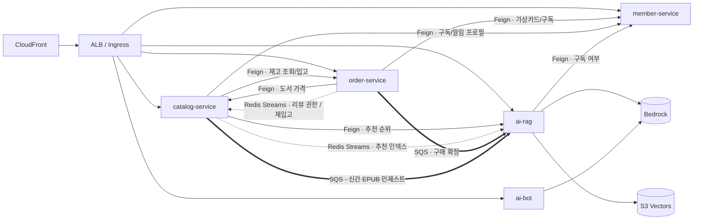
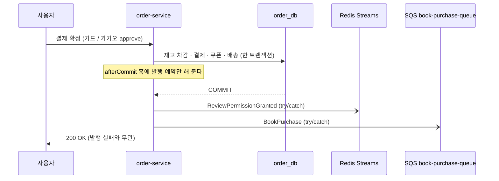
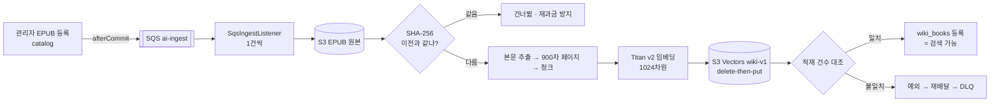
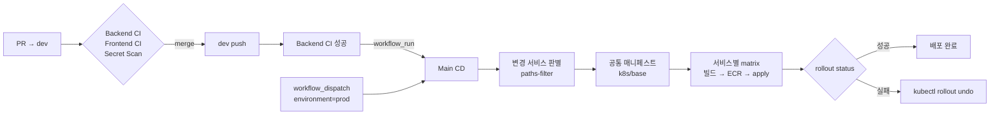

# 📚 책 먹는 사자 (Book Eating Lion)

> **트래픽이 몰려도 결제가 튕기지 않고 재고 오류가 0건인 AWS EKS 기반 MSA 온라인 서점.**
> 구매한 책은 eBook으로 읽고, AI 사서 "라이언"에게 그 책의 내용을 물어볼 수 있다(RAG).

재고를 주문 서비스가 소유하도록 경계를 그어, 4개 서비스로 나누고도 결제는 분산 트랜잭션(Saga) 없이 한 서비스의 로컬 트랜잭션으로 끝난다.

`Java 21` · `Spring Boot 3.4` · `PostgreSQL 16 (RDS + RDS Proxy + Read Replica)` · `ElastiCache Valkey 8.2` · `Amazon SQS / SNS` · `Amazon Bedrock` · `S3 Vectors` · `Amazon EKS 1.34 + Karpenter` · `Terraform` · `GitHub Actions`

---

## 목차

1. [아키텍처](#아키텍처)
2. [설계 하이라이트](#설계-하이라이트)
3. [서비스 구성](#서비스-구성)
4. [주요 백엔드 로직](#주요-백엔드-로직)
5. [인프라 · 비용 설계](#인프라--비용-설계)
6. [성능 · 안정성 검증 (k6)](#성능--안정성-검증-k6)
7. [CI/CD · 배포 흐름](#cicd--배포-흐름)
8. [롤백 방법](#롤백-방법)
9. [실행 방법](#실행-방법-로컬-재현)
10. [트러블슈팅](#트러블슈팅)
11. [팀원 역할](#팀원-역할)

---

## 아키텍처

<!-- TODO(아키텍처 도식): 최신 AWS 아키텍처 도식으로 교체한다.
     예) 
     (이전 버전 도식: docs/개발 문서/Book_eating_lion_AWS_Architecture.png) -->

> 🖼 **아키텍처 도식 자리** — 최신 도식으로 교체 예정

서비스 사이의 **호출·이벤트 흐름**만 따로 그리면 이렇다(인프라 배치는 위 도식 참고).



실선은 동기(OpenFeign + Resilience4j), 점선은 Redis Streams, 굵은 선은 SQS다. 결제·구매·인제스트·추천 이벤트는 **DB 커밋 이후에만** 나간다([§4-1](#4-1-이벤트는-커밋이-끝난-뒤에만-발행한다)).

---

## 설계 하이라이트

| 풀어야 했던 문제 | 설계 | 자세히 |
| --- | --- | --- |
| 한정판에 결제가 몰려도 **오버셀링 0건** | 재고를 order-service가 소유 → 락·차감·결제가 한 로컬 트랜잭션. `bookId` 정렬 Redisson 락으로 데드락 제거, 쿠폰·주문은 `FOR UPDATE` | [4-3](#4-3-재고결제-동시성--오버셀링-0건) |
| 카카오페이는 승인 후 환불 경로가 없다 | 승인 API를 부르기 **전에** 재고·쿠폰·중복 구독을 재검증 → 막히면 돈이 나가지 않음 | [4-3](#4-3-재고결제-동시성--오버셀링-0건) |
| 롤백된 주문에 권한이 새면 결제 안 한 책을 읽는다 | 결제·구매·인제스트·추천 이벤트를 **커밋 이후**에 발행, 채널별 독립 예외 경계, 소비 측 멱등 | [4-1](#4-1-이벤트는-커밋이-끝난-뒤에만-발행한다) |
| 이벤트마다 필요한 전달 보장이 다르다 | 유실 불가 → **SQS + DLQ**, 한 번만 처리 → **Redis Streams 컨슈머 그룹**, 모든 파드에 → **Pub/Sub** | [4-2](#4-2-메시징-채널-sqs--redis-streams--redis-pubsub--sns) |
| 결제 서비스 장애가 서점 전체로 번진다 | 리뷰 권한을 구매 시점에 **미리 발급**(묻지 않음), 조회는 degrade · 돈이 걸린 호출은 fail-closed | [4-6](#4-6-장애-격리와-graceful-degradation) |
| 읽기가 대부분인 카탈로그가 DB를 압박 | `readOnly` 트랜잭션 기준 writer(RDS Proxy) / reader(리플리카) 자동 라우팅 | [4-4](#4-4-db-읽기쓰기-분리-catalog-service) |
| LLM은 근거가 없으면 지어내고, 권한 없는 본문을 인용할 수 있다 | 열람 권한 교집합을 **벡터 인덱스 필터**로 내리고, 거리 가드를 못 넘으면 **LLM을 부르지 않는다** | [4-5](#4-5-ai--rag) |
| 멀티 파드에서 WebSocket 상담 | 1회용 티켓 핸드셰이크, 하트비트 ZSET 접속 집계, Lua 원자적 배정, Pub/Sub 팬아웃 | [4-7](#4-7-실시간-11-상담-멀티-파드-websocket) |
| 서비스 경계가 코드에서 무너진다 | 스키마별 DB 계정, CI 모듈 경계 검사, `/internal/**` 미노출 + NetworkPolicy | [4-8](#4-8-보안-경계) |
| 한 클러스터의 dev 부하 테스트가 prod를 굶긴다 | 네임스페이스별 ResourceQuota + PriorityClass(prod 우선) + 환경별 HPA 상한 | [5](#인프라--비용-설계) |
| 설정 오타는 에러 없이 틀린 동작만 낸다 | CI가 ConfigMap 키·FE/BE 설정값·YAML 중복 키를 대조, 기동 시 벡터 인덱스 검증, apply 전 IAM 권한 대조 | [7](#배포-전에-잡는-조용한-고장) |
| 장애 중에 도는 롤백이 또 장애를 낸다 | 40자리 SHA 검증, ECR 이미지 존재 확인, Liquibase 변경 경고 후 실행 | [8](#롤백-방법) |

---

## 서비스 구성

**서비스 4개 / Deployment 5개**. `ai-service`는 이미지 1개를 Deployment 2개(`ai-rag`, `ai-bot`)로 띄운다 — 두 워크로드의 확장 기준과 타임아웃 정책이 다르기 때문이다.

| 서비스 | 담당 도메인 | 포트 | DB 스키마 (전용 계정) | 외부 의존 | HPA (dev / prod) |
| --- | --- | --- | --- | --- | --- |
| `catalog-service` | 도서·카테고리, 리뷰·찜·최근 본 책, eBook 열람·하이라이트, 재입고 알림, FAQ·상품문의, 추천 카드 | 8081 | `catalog_db` (`catalog_svc`) — **writer/reader 분리** | S3(eBook), SES, SQS 발행 | 2 → 6 / 10 · CPU 70%·Mem 80% |
| `order-service` | 주문·결제(가상카드, 카카오페이)·배송, **재고(inventory)**, 장바구니, 쿠폰 | 8082 | `order_db` (`order_svc`) | Redisson 분산 락, KakaoPay, SQS 발행 | 2 → 8 / 30 · CPU 70% |
| `member-service` | 회원·인증(Cognito), 배송지, 가상카드, 구독 | 8083 | `member_db` (`member_svc`) | Cognito | 2 → 6 · CPU 70% |
| `ai-service` (`ai-rag`) | 먹인 책 RAG(`/api/ai/lion`), 라이언 육성, 의미 기반 추천 | 8084 | `ai_db` (`ai_svc`) + S3 Vectors | Bedrock, S3 Vectors, SQS 소비 | 1 → 6 · CPU 70% |
| `ai-service` (`ai-bot`) | 문의봇(FAQ 근거 LLM), 1:1 상담 채팅(WebSocket) | 8084 | `ai_db` + Redis(상담방 상태) | Bedrock | 1 → 10 · 동시 요청 수 ⚠️ |

> ⚠️ `ai-bot` HPA는 커스텀 메트릭(`http_server_requests_active`)이라 Prometheus Adapter/KEDA가 있어야 동작한다. 현재 클러스터에는 없으므로 실제 방어선은 Bulkhead 격리다([4-5](#4-5-ai--rag)). I/O 바운드인 봇은 요청 100건이 동시에 몰려도 CPU가 5% 언저리라 CPU 기준 HPA로는 영원히 늘지 않는다.

**DB 격리는 클러스터가 아니라 계정 권한으로 만든다.** PostgreSQL 인스턴스 하나에 스키마 4개, 스키마마다 전용 계정이 소유자다. `catalog_svc`로 `order_db`를 조회하면 `permission denied for schema order_db`다.

### 인프라 구성 요소 (integrated 환경 기준)

| 구성 요소 | 스펙 | 쓰는 곳 |
| --- | --- | --- |
| RDS PostgreSQL 16 | `db.t4g.micro` writer 1 + **read replica 1**, 앞단 **RDS Proxy** | 클러스터 1개 / 스키마 4개 / 계정 4개 |
| ElastiCache Valkey 8.2 | `cache.t4g.medium`, **TLS 강제**(`transit_encryption_enabled`) | 분산 락, 캐시, Streams, Pub/Sub, 쿼터 |
| Amazon SQS | `ai-ingest`(visibility 300s), `book-purchase-queue`(60s) + 각 DLQ(14일 보관, `maxReceiveCount=3`) | 유실 불가 도메인 이벤트 |
| Amazon SNS | 알람 토픽 1개 → 이메일 구독 | CloudWatch 알람(DB 커넥션·CPU·메모리, Valkey 메모리, Pod CPU) |
| Amazon Bedrock | 임베딩 `titan-embed-text-v2`(1024차원) · RAG `Claude Haiku 4.5` · 봇 `Nova Micro` | ai-service |
| S3 Vectors | `wiki-v1`(책 본문), `recommendation-books-v1`(추천) — cosine | ai-service |
| Amazon Cognito | User Pool (서버 사이드 `AdminInitiateAuth`) | member-service, 전 서비스 JWT 검증 |

### 라우팅 (Ingress)

| 경로 | 서비스 |
| --- | --- |
| `/api/catalog/**` | catalog-service |
| `/api/orders/**` `/api/cart/**` `/api/coupons/**` `/api/payments/**` | order-service |
| `/api/members/**` `/api/auth/**` `/api/cards/**` | member-service |
| `/api/ai/lion/**` | ai-rag |
| `/api/ai/bot/**` `/ws/ai/chat` | ai-bot |

### 코드 구조와 경계

```text
backend/
├── contracts/          # OpenAPI 4종 — 서비스 간 계약의 단일 진실 공급원
├── apps/               # 배포 단위 = bootJar = 컨테이너 이미지 (Feign·AWS SDK·설정 배선)
│   ├── catalog-api/  order-api/  member-api/  ai-api/
└── modules/            # 도메인 로직(라이브러리 jar). 서로 의존 금지
    ├── common/         # BaseEntity, 응답/예외, 이벤트 계약(Stream 키), Redis 공통 설정
    ├── book/  order/  member/  ai/
```

모노레포를 유지하는 대신 경계를 **기계적으로 두 번** 강제한다.

1. **CI** (`backend-ci.yml` › 모듈 경계 규칙): `apps/X-api`는 `common` + 자기 도메인 모듈만, `modules/*`는 `common`만 참조할 수 있다. 위반하면 빌드 실패.
2. **CODEOWNERS**: 도메인 디렉터리별로 리뷰 소유 팀을 지정한다(계약 `contracts/`는 백엔드 전원).

외부 연동은 가능한 한 포트로 분리해 구현체를 `apps`에 둔다 — 예: `BookPurchasePublisher` → `SqsBookPurchasePublisher`, `EbookStoragePort` → S3/로컬 어댑터, `VectorSearchPort` → `S3VectorSearchAdapter`, `InventoryPort` → Feign 어댑터. 도메인 모듈이 SQS·S3 SDK를 모르게 하고, 로컬에서는 어댑터만 바꿔 끼운다.

---

## 주요 백엔드 로직

### 4-1. 이벤트는 커밋이 끝난 뒤에만 발행한다

트랜잭션 안에서 이벤트를 먼저 보내면, 그 뒤 단계(쿠폰 사용 확정, 배송 생성의 UNIQUE 충돌 등)에서 롤백이 나도 **이미 나간 이벤트는 되돌릴 수 없다.** 리뷰 권한 이벤트가 한때 커밋 전에 나가는 구조였고, 실제로 이벤트 발행 뒤에 주문이 롤백되는 결제 장애(2026-08-27)가 있었다. 리뷰 권한은 eBook 열람 권한을 겸하므로 새어 나가면 **결제되지 않은 책을 읽을 수 있게 된다**([트러블슈팅](docs/troubleshooting-event-publishing.md)).



그래서 모든 "상태를 바꾼 뒤 남에게 알리는" 지점이 같은 규칙을 따른다.

| 발행 지점 | 채널 | 방식 |
| --- | --- | --- |
| `OrderService.publishPurchaseConfirmed` | Redis Streams + SQS | `TransactionSynchronization.afterCommit` |
| `OrderService.activateSubscriptionIfOrdered` | Feign(member) | `afterCommit` — 트랜잭션 안에서 실패하면 **돈은 나갔는데 주문은 미결제**로 롤백된다 |
| `AdminBookService.publishIngestEvent` | SQS | `afterCommit` |
| `BookRecommendationIndexPublisher` | Redis Streams | `@TransactionalEventListener(AFTER_COMMIT)` |
| `BookPurchaseHandler` / `FeedService` (캐시 갱신) | Redis Set | `afterCommit` — 롤백됐는데 캐시에만 남는 불일치 방지 |

발행 규칙 세 가지:

1. **채널마다 따로 `try/catch`** — 한 `Runnable` 안에서 Redis 발행이 던지면 뒤의 SQS 발행이 아예 안 나간다.
2. **예외를 호출자에게 올리지 않는다** — 커밋은 이미 끝났다. 던져 봐야 사용자에게 500만 보이고 되돌릴 것은 없다. 대신 `memberId`/`bookId`를 담은 ERROR 로그를 남긴다.
3. **소비 측은 전부 멱등** — at-least-once 전제. 리뷰 권한은 PK `(memberId, orderItemId)` 중복 확인, 구매는 PK `(memberId, bookId)`, 재입고는 `processed_restock_events`, 인제스트는 결정적 벡터 키 + delete-then-put.

> ⚠️ **알려진 예외** — 관리자 입고(`InventoryService.restock`)의 `InventoryRestockedEvent`는 아직 트랜잭션 **안에서** 바로 Redis Stream에 발행한다. 커밋이 실패하면(예: 동시 주문과의 `@Version` 충돌) 재고는 0 그대로인데 재입고 알림 메일이 먼저 나갈 수 있다. 같은 `afterCommit` 패턴으로 옮기는 것이 남은 과제다.

### 4-2. 메시징 채널: SQS · Redis Streams · Redis Pub/Sub · SNS

채널은 **"이 장애가 전이돼도 되는가"**로 고른다. 지금 이 응답에 값이 필요할 때만 동기(OpenFeign + Resilience4j)로 묻고, 나머지는 비동기로 미리 넘기거나 아예 묻지 않는다. 예컨대 리뷰 작성 시 "구매했나?"를 order에 묻지 않는다 — 구매 확정 시점에 order가 `ReviewPermissionGranted`로 권한을 미리 넘겨 두므로 **order-service가 죽어도 리뷰 작성은 동작한다.**

| 채널 | 전달 보장 | 이 프로젝트에서 쓰는 곳 | 고른 이유 |
| --- | --- | --- | --- |
| **SQS + DLQ** | at-least-once, 재시도, DLQ 보관 | 구매 확정(order→ai), 신간 EPUB 인제스트(catalog→ai) | 유실되면 **에러 없이 "근거를 못 찾았습니다"만 나온다.** 조용히 틀리는 이벤트는 큐가 보관해야 한다 |
| **Redis Streams + 컨슈머 그룹** | 그룹 안에서 **한 파드만** 처리 | 리뷰 권한, 재입고 알림, 추천 인덱스 갱신 | 파드가 2~20개로 늘어도 한 번만 처리. 이미 쓰는 Redis라 Kafka를 새로 들이지 않았다 |
| **Redis Pub/Sub** | at-most-once, **모든 구독 파드**에 팬아웃 | 1:1 상담 채팅 | 그 방의 소켓을 쥔 모든 파드가 받아야 한다. 컨슈머 그룹을 쓰면 엉뚱한 파드 하나로 가서 조용히 버려진다 |
| **SNS** | 알림 팬아웃 | CloudWatch 알람 → 이메일 | 애플리케이션 이벤트가 아니라 **운영 알림 전용**이다 |

**이벤트 목록**

| 이벤트 | 발행 → 소비 | 채널 / 키 | 멱등 처리 |
| --- | --- | --- | --- |
| 구매 확정 | order → ai | SQS `book-purchase-queue` (10건 배치) | `purchased_books` PK |
| 신간 EPUB 등록 | catalog → ai | SQS `ai-ingest` (1건씩) | 원본 SHA-256 비교 + 결정적 벡터 키 |
| 리뷰 권한 발급 | order → catalog | Stream `events:review-permission-granted` / 그룹 `catalog-service` | `review_permissions` PK |
| 재입고 | order → catalog | Stream `events:inventory-restocked` / 그룹 `catalog-restock-alerts` | `processed_restock_events` |
| 추천 인덱스 갱신 | catalog → ai | Stream `events:catalog:recommendation-books` / 그룹 `ai-recommendation-indexer` | 실패 시 ACK 안 함 → pending 보존 |

**SQS 소비 규칙** (`SqsWorker`)

- 핸들러가 **정상 반환했을 때만** 메시지를 삭제한다. 예외면 남겨 두고, 가시성 시간 후 재배달 → `maxReceiveCount` 초과 시 DLQ(14일 보관).
- 폴링 예외로 루프를 끝내지 않는다 — 파드는 살아 있는데 소비만 멈추는 게 가장 늦게 발견되는 고장이다.
- 인제스트는 **1건씩**(임베딩 스로틀링), 구매는 **10건 배치**(DB 1행 + Redis 1행이라 가벼움).
- 로컬에서는 `SQS_*_ENABLED=false`가 기본이다 — 켜면 배포된 컨슈머와 실제 이벤트를 **경쟁**해서 가져간다.

**Redis 사용처 한눈에**

| 키 / 채널 | 용도 | 장애 시 |
| --- | --- | --- |
| `inventory:lock:{bookId}` | 재고 차감 분산 락 (Redisson) | 락 획득 실패 → 주문 거절 |
| `bestsellers::*` | 베스트셀러 캐시(TTL 30분) | DB 직접 조회 |
| `ai:purchased:{memberId}` / `ai:fed:{memberId}` | RAG 접근 권한 / 먹인 책 Set (TTL 24h) | **DB 원본으로 폴백**(fail-closed) |
| `ai:quota:{memberId}:{date}` | 일일 질의 상한 | **통과**(fail-open) + WARN |
| `catalog:recommendation:queue:{memberId}` | 스와이프 추천 카드 큐 | 키 삭제 후 다시 생성 |
| `events:*` | Redis Streams | 컨슈머 그룹 pending 보존 |
| 상담방 Hash/ZSet + Pub/Sub 채널 | 1:1 채팅 상태·전사(24h TTL, DB 미저장) | 방 휘발 |

### 4-3. 재고·결제 동시성 — 오버셀링 0건

재고(`order_db.inventory`)는 상품이 아니라 **주문 서비스가 소유**한다. 애그리게잇 경계를 라이프사이클이 아니라 트랜잭션 경계로 정했고, 덕분에 락 → 재고 차감 → 결제가 한 서비스 안의 로컬 트랜잭션이다. 카탈로그는 재고를 `GET /internal/inventory?bookIds=` **벌크 조회**로만 읽는다(단건 API면 목록에서 N+1이 난다).

- **분산 락**: `InventoryLockExecutor`가 주문에 담긴 `bookId`를 **오름차순 정렬 후** 순서대로 락을 건다(`wait 5s / lease 10s`). `[1,2]`와 `[2,1]` 주문이 동시에 와도 데드락이 없다.
- **결제 2종**
  - 가상카드: `createOrder` 한 트랜잭션에서 결제·재고 차감·쿠폰 확정·장바구니 정리·배송 생성까지 끝낸다.
  - 카카오페이: `createOrder`는 `ready`만 하고 `PENDING_PAYMENT`로 둔다. `approveKakaoPay`에서 **카카오 승인 API를 부르기 전에** 재고·쿠폰·중복 구독을 재검증한다 — 막히면 승인 요청 자체가 안 나가므로 **환불 로직이 필요 없다**.
- **비관적 락 보강**: 쿠폰(`MemberCoupon`)과 카카오 승인 대상 주문을 `SELECT … FOR UPDATE`로 읽는다. 낙관적 락만으로는 충돌이 커밋 시점에야 드러나는데, 그땐 이미 결제가 끝나 되돌릴 수 없다.
- **구독권 = 카탈로그의 도서 한 권(`book_id 9001`)**: 구독을 별도 상품 타입으로 만들지 않고 도서 한 행으로 표현해 가격 조회·주문·결제·주문 내역이 전부 기존 경로를 탄다. 결제 전 중복 구독을 검사하고(조회 실패는 503, fail-closed), 결제 확정 후 `afterCommit`에서 member-service에 활성화를 요청한다(멱등 엔드포인트).
- **Redisson 전용 커넥션**: 이벤트/캐시용 `RedisTemplate`과 분리했고, Redisson은 `spring.data.redis.ssl.enabled`를 자동으로 읽지 않아 `rediss://` 스킴을 직접 고른다.

### 4-4. DB 읽기/쓰기 분리 (catalog-service)

카탈로그는 읽기가 대부분이라 **writer / reader 커넥션을 나눈다.**

```text
@Transactional(readOnly = true) ──▶ reader 풀 (8) ──▶ Read Replica   (RDS Proxy 우회, 직결)
@Transactional                  ──▶ writer 풀 (3) ──▶ RDS Proxy ──▶ Primary
```

- `RoutingDataSourceConfig`: `AbstractRoutingDataSource`가 `TransactionSynchronizationManager.isCurrentTransactionReadOnly()`로 분기한다. 조회 서비스에는 이미 `readOnly = true`가 붙어 있어 손댈 곳이 거의 없었다.
- **`LazyConnectionDataSourceProxy`가 핵심이다.** 없으면 Spring이 트랜잭션 시작 *전에* 커넥션을 먼저 잡아서 readOnly 판단 시점이 지나가 버린다 — 에러 없이 **조용히 전부 writer로** 간다.
- Liquibase는 트랜잭션 밖에서 자기 커넥션을 쓰므로 자동으로 writer로 간다.
- `@Profile("prod")`에서만 켠다. 로컬은 표준 `spring.datasource` 하나로 뜬다.
- reader는 Proxy를 거치지 않으므로 `Pod 수 × reader 풀`이 리플리카의 `max_connections`를 직접 압박한다. 풀 크기는 ConfigMap(`DB_WRITER_POOL_SIZE` / `DB_READER_POOL_SIZE`)으로 조절한다.
- k8s에서는 `db-primary-service` / `db-reader-service`(ExternalName, 네임스페이스별)가 각각 Proxy writer 엔드포인트와 리플리카를 가리킨다. order/member/ai는 writer(Proxy) 하나만 쓴다.

> 배포 순서 주의: 라우팅 코드가 **먼저** 배포된 뒤에 리플리카를 붙여야 한다. 거꾸로 하면 catalog의 쓰기와 기동 시 Liquibase가 read-only 트랜잭션 에러로 죽는다.

### 4-5. AI · RAG

#### 인제스트 — 책 한 권을 검색 가능한 상태로



- **순서가 계약이다**: 벡터 적재와 건수 검증이 끝난 **뒤에만** `wiki_books`에 등록한다. 반대로 하면 벡터가 반만 들어간 책이 검색 대상으로 노출된다.
- **멱등**: 벡터 키는 `{bookId}#{page}#{chunkSeq}`로 결정적이고, 적재 전에 그 책의 기존 벡터를 지운다.
- **ID 충돌 방어**: 같은 `bookId`에 제목이 다른 책이 오면 조용히 덮어쓰지 않고 시끄럽게 실패한다.
- 청크는 페이지 경계를 넘지 않는다 — 인용의 쪽수가 항상 하나로 정해진다.

#### 질의 — `POST /api/ai/lion/ask`

1. **쿼터 확인** (`DailyQuota`) — 무료 5회 / 구독 50회. 초과한 사용자에게 임베딩 비용을 태우지 않도록 **처리 전에** 본다.
2. **모드 결정** (`QueryRouter`) — "왜/어떻게/요약" 같은 설명 요구가 있으면 `answer`(LLM), 아니면 `search`(LLM 없음, 비용 0).
3. **접근 제어** — 검색 허용 목록 = **구매한 책 ∪ (구독 중이면) 인제스트된 책 전체**. 클라이언트의 `bookIds`는 **교집합으로 좁히기만** 한다(합집합이면 남의 책 본문이 새어 나간다). 비면 검색 자체를 하지 않는다.
4. **임베딩 → 벡터 검색** — 허용 목록을 S3 Vectors `filter: {"bookId": {"$in": [...]}}`로 내려 **인덱스가 직접 거른다.** 전건 검색 후 자바에서 거르면 topK를 남의 책이 채워 결과가 조용히 나빠진다.
5. **개인 메모 제외** — `sourceType = user_summary` 벡터는 인용하지 않는다.
6. **거리 가드** — cosine distance가 `AI_MAX_DISTANCE`(기본 0.75)보다 먼 근거는 버린다. **근거가 없으면 LLM을 부르지 않고** "근거를 찾지 못했습니다"를 돌려준다 — 근거 없이 LLM을 부르면 반드시 지어낸다.
7. **선별** — 같은 (책, 쪽)은 병합, 책당 최대 3개, 컨텍스트 예산 12KB.
8. **생성** — `answer` 모드에서만 Claude Haiku 4.5(temperature 0.2)가 `[1]`, `[2]` 인용 번호를 달아 답한다.
9. **사용량 기록** — 실제로 과금되는 일(임베딩·검색)을 했을 때만 쿼터를 1 올린다.

#### 장애를 다루는 방식이 기능마다 다르다

| 기능 | Redis/외부 장애 시 | 이유 |
| --- | --- | --- |
| 일일 쿼터 | **fail-open**(통과) + WARN | 과금 방어선이지 인증이 아니다. 공유 Redis 장애를 RAG 장애로 번지게 하지 않는다 |
| 접근 제어(구매 목록 캐시) | **fail-closed** — DB 원본으로 폴백 | 틀리면 안 되는 필터다 |
| 임베딩/벡터 검색 실패 | `grounded=false`로 degrade (503 아님) | AI 장애가 상담·주문으로 전이되면 안 된다 |
| 구독 조회 실패 | 비구독으로 강등(무료 상한, EXP 1배) | Feign fallback |

외부 API는 **Bulkhead를 셋으로 나눠** 격리한다 — `aiEmbedding`(20), `aiLlm`(10), 문의봇 `aiExternalApi`(20). LLM이 느려져도 `search` 모드(임베딩만)는 막히지 않는다. `@Bulkhead`는 AOP 프록시를 타야 하므로 `GuardedAiCalls`라는 얇은 층으로 분리했다(같은 클래스 안에서 부르면 격리가 조용히 사라진다).

기동 시 `VectorIndexVerifier`가 S3 Vectors 인덱스의 차원·거리척도·비필터 키를 설정과 대조하고, 다르면 **파드를 Ready로 만들지 않는다** — 어긋난 인덱스는 에러 없이 틀린 결과만 내기 때문이다.

#### 그 밖의 AI 기능

- **라이언 육성** — 완독한 책을 먹이면 EXP가 오른다(구독자 2배). 외부 API 호출 0회의 순수 게이미피케이션이고, `fed_books` PK로 중복 적립을 막는다.
- **의미 기반 추천** — 도서 변경이 커밋되면 Redis Stream으로 ai의 추천 인덱서(`recommendation-books-v1`)에 반영된다. catalog가 사용자의 행동 이력(찜·최근 본 책·구매 등)을 근거 문장으로 넘기면 ai가 그 인덱스에서 순위를 매기고, 결과 카드 큐는 Redis에 캐시한다.
- **문의봇 · 1:1 상담** — 문의봇이 FAQ만 근거로 1차 응답하고(`ai-bot`, Bulkhead `aiExternalApi`), 필요하면 상담사에게 연결한다. 상담 채팅 설계는 [4-7](#4-7-실시간-11-상담-멀티-파드-websocket).

### 4-6. 장애 격리와 Graceful Degradation

원칙은 두 줄이다. **조회는 degrade해서라도 응답한다. 돈이 걸린 판단은 확인 없이 통과시키지 않는다(fail-closed).**

| 장애 | 영향받는 기능 | 동작 | 이유 |
| --- | --- | --- | --- |
| order-service 다운 | 도서 목록·상세의 재고 | **HTTP 200**, `stockQuantity: -1`(조회 실패, 품절 `0`과 구분) | 어차피 구매가 불가능하니 재고 숫자만 잠시 안 보이면 된다 |
| order-service 다운 | 리뷰 작성 · eBook 열람 | **정상** — 구매 시점에 받은 권한으로 판단 | 리뷰가 결제 가용성에 종속되지 않게 |
| order-service 다운 | 관리자 입고 | 예외 → 재시도 안내 | 쓰기는 성공한 척하면 안 된다 |
| catalog-service 다운 | 장바구니 / 주문 | 장바구니는 "정보 조회 불가"로 표시, **주문은 거절** | 가격을 모르는 채로 `price=0` 주문이 승인되면 안 된다 |
| member-service 다운 | 가상카드 차감 | **결제 거절** | 한도 확인 없이 돈을 움직이지 않는다 |
| member-service 다운 | 구독권 결제 전 중복 검사 | **503** | 잘못 통과시키면 이중 결제가 돈이 나간 뒤에 드러난다 |
| member-service 다운 | AI 쿼터·EXP 배율의 구독 여부 | 비구독으로 강등 | 무료 상한 · EXP 1배로 안전하게 |
| ai-service 다운 | 추천 카드 | 규칙 기반(인기순) 추천으로 전환 | |
| Bedrock / S3 Vectors 장애 | RAG 질의 | `grounded=false` (503 아님) | AI 장애가 상담·주문으로 번지지 않게 |
| Redis 장애 | 일일 쿼터 / RAG 권한 캐시 / 상담 티켓 | 통과 / **DB 원본 폴백** / **거부** | 과금 방어선은 fail-open, 접근 제어·인증은 fail-closed |

Feign 호출은 Resilience4j 서킷 브레이커를 거쳐 위 fallback으로 떨어진다(`spring.cloud.openfeign.circuitbreaker.enabled` — 꺼져 있으면 `fallback` 속성이 조용히 무시된다). 첫 줄은 로컬에서 order 프로세스를 내려 직접 확인할 수 있다([실행 방법 5단계](#5-동작-확인)).

### 4-7. 실시간 1:1 상담 (멀티 파드 WebSocket)

사용자와 상담사의 소켓이 **서로 다른 파드**에 붙을 수 있다는 전제에서 출발했다. 상태는 전부 Redis에 두고(방·전사 24h TTL, 방당 메시지 500개 · 1,000자 상한) DB에는 남기지 않는다.

- **JWT를 URL에 싣지 않는다.** 브라우저는 `new WebSocket()`에 `Authorization` 헤더를 붙일 수 없다. JWT를 쿼리로 보내면 액세스 로그·히스토리·`Referer`에 남으므로, 평범한 REST(`POST /api/ai/bot/chat/ticket`)로 신원을 확인한 뒤 **30초짜리 1회용 교환권**만 URL로 보낸다. 교환권은 `GETDEL`로 원자적으로 소비해 같은 링크로 두 소켓이 붙지 못한다.
- **핸드셰이크가 유일한 인증 지점이다.** 이후 프레임에 담긴 필드는 신원으로 쓰지 않는다. Redis 장애 시 티켓 검증은 fail-closed이고, 실패는 403이 아니라 **401**로 내려 프론트가 "티켓 재발급 후 재연결"과 "권한 없음"을 구분한다. 상담사 판정은 Cognito 그룹(`cognito:groups`)으로만 하고 티켓에 굳혀 넣는다.
- **Origin 검사는 서버가 한다.** WebSocket은 CORS preflight가 없어 Ingress의 CORS 설정이 적용되지 않는다(`CHAT_ALLOWED_ORIGINS`).
- **접속 중인 상담사는 Set이 아니라 하트비트 ZSET으로 센다.** OOMKill·노드 유실·노트북 덮개 닫기에서는 종료 콜백이 불리지 않아 Set에 유령이 남고, "상담사가 없으면 즉시 게시판 안내" 규칙이 조용히 무력화된다. 마지막 Pong 시각을 score로 두고 grace(60s, 서버 Ping 20s의 3배) 안의 범위만 센다.
- **배정은 Lua 스크립트 하나**로 상태 확인 · 전이 · 대기열 제거를 원자적으로 처리한다. 두 상담사가 동시에 눌러도 정확히 한 명만 이긴다.
- **팬아웃은 Pub/Sub**(컨슈머 그룹 아님). 소켓이 붙을 때 구독을 먼저, 전사 조회를 나중에 해 유실 없이 겹쳐 받게 하고 중복은 `seq`로 지운다. 방은 메시지 본문이 아니라 **채널명**으로 판별한다.

### 4-8. 보안 경계

| 경계 | 설계 |
| --- | --- |
| 서비스 간 전용 API | `/internal/**`은 Ingress에 **라우팅하지 않는다**. 추가로 NetworkPolicy가 order-service 인바운드를 catalog-service로만 좁힌다(kubelet probe는 Pod가 아니라 노드 IP에서 오므로 노드 대역을 따로 연다) |
| 인증 | Cognito가 발급한 JWT를 4개 서비스가 각자 Resource Server로 검증한다. 회원 식별(`sub`)과 닉네임은 토큰 클레임에서 읽어 **매 요청마다 member-service를 부르지 않는다** — 인증이 모든 요청의 임계 경로가 되지 않게 |
| eBook 원본 | 퍼블릭 액세스를 차단한 S3 버킷 + **10분짜리 Presigned URL**. 열람 권한 = 구매 이력 ∪ 구독 |
| 데이터 경계 | 스키마별 전용 계정 · 남의 스키마엔 GRANT 없음 · `public` 스키마 CREATE 회수 |
| AWS 자격증명 | CI는 GitHub OIDC로 역할을 받는다(장기 액세스 키 없음). 파드는 서비스별 **IRSA**로 필요한 권한만(SQS 발행/소비, 미디어 버킷, Bedrock, S3 Vectors) |
| 엣지 | CloudFront + WAF(IP당 rate limit, AWS 관리형 공통 규칙). 오리진 NLB가 인터넷에 열려 WAF를 우회할 수 있던 것을 부하 테스트 중 발견해, **CloudFront origin-facing prefix list만** 허용하도록 막았다 |
| 시크릿 | gitleaks로 PR·push마다 전체 히스토리 스캔, 값은 GitHub Environments / Secrets Manager / SSM에만 |

---

## 인프라 · 비용 설계

작은 팀 예산으로 운영 환경 두 벌을 돌리기 위한 결정들이다.

- **클러스터 하나에 dev/prod 두 네임스페이스(integrated).** 대신 서로를 굶기지 못하게 막았다.
  - 네임스페이스별 **ResourceQuota** — 불변식 `quota ≥ Σ(maxReplicas × 파드 요청량) + 롤링 서지 여유`. 이게 깨지면 HPA가 천장에 닿는 순간 롤링 업데이트의 새 파드가 admission에서 거절돼 배포가 멈춘다([트러블슈팅](docs/troubleshooting-deploy-scaling.md#4-resourcequota가-꽉-차서-롤링-업데이트가-새-파드를-하나도-못-만들었다)).
  - **PriorityClass** prod 1000 / dev 100 — 노드가 모자라면 dev가 먼저 밀려난다.
  - HPA 상한을 환경별로 분리(catalog 6/10, order 8/30), DB ExternalName Service도 네임스페이스별로 둬 dev가 prod DB를 가리킬 수 없게 했다.
- **Karpenter**: 스팟 + 온디맨드 혼합, `WhenEmptyOrUnderutilized` 30초 consolidation, 스팟 회수 통지를 EventBridge → SQS(interruption queue)로 받아 회수 전에 노드를 비운다.
- **DB 한 대**: RDS PostgreSQL 인스턴스 하나에 스키마 4개(격리는 계정 권한), 벡터는 S3 Vectors로 빼서 pgvector용 클러스터가 따로 필요 없다. 쓰기는 RDS Proxy가 멀티플렉싱하고 읽기는 리플리카가 받는다.
- **AI 비용 방어선**: 일일 쿼터(과금되는 일을 한 질의만 차감) · `search` 모드는 LLM 0회 · 근거가 없으면 LLM 미호출 · 같은 EPUB은 SHA-256 비교로 재임베딩 생략 · 인제스트는 1건씩(스로틀링 재시도로 과금이 불어나지 않게) · SQS 리스너는 기본 꺼짐(로컬에서 모르게 과금되지 않게).
- **Terraform 계층 분리**: `00-base`(DNS·인증서·WAF·S3·ECR·GitHub OIDC) → `01-data`(RDS·RDS Proxy·Valkey·SQS·Cognito) → `02-runtime`(EKS·Karpenter·ALB·엣지 라우팅·서비스별 IRSA). state가 나뉘어 있어 데이터 계층을 두고 런타임만 부수고 다시 만들 수 있다. AWS가 만드는 값은 SSM Parameter Store 하나를 원본으로 CD가 읽는다.
- **알림**: RDS 커넥션·CPU·메모리, Valkey 메모리, Pod CPU CloudWatch 알람이 SNS 토픽 하나로 모여 이메일로 온다.

---

## 성능 · 안정성 검증 (k6)

기획 단계의 KPI를 시나리오로 1:1 매핑했다. GitHub Actions와 분리된 별도 EC2에서 실행하고, 같은 스크립트를 `TARGET_ENV`만 바꿔(EC2 단일 배포 vs EKS MSA) 결과를 비교한다.

| 시나리오 | 검증하는 것 | 합격 기준 |
| --- | --- | --- |
| `01-traffic-spike` | 1초 만에 5,000 VU — HPA 스케일아웃 | P95 < 500ms, 에러율 < 0.1% |
| `02-cache-offload` | 베스트셀러 캐시의 DB 오프로딩 | 캐시 적용 전후 DB CPU·응답시간 비교 |
| `03-pod-failure` | 부하 중 AI 파드 강제 종료 시 장애 격리 | 주문·결제 성공률 100% 유지 |
| `04-rolling-deploy` | 부하 중 배포 | 5xx 0건 |
| `05-payment-concurrency` | 재고 100권에 1,000 VU 동시 주문 | **오버셀링 0건** (k6가 아니라 DB 직접 조회로 확정) |
| `06-chat-concurrency` | 서로 다른 파드 간 상담 메시지 브로드캐스트 | 유실률 · 지연 |
| `07-connection-saturation` | 계단식 부하로 5xx가 튀는 지점 | RDS Proxy 적용 전후 비교 |
| `08-namespace-contention` | dev 부하가 prod 응답시간에 주는 간섭 | 공유 클러스터의 격리 근거 |
| `09-hpa-metric-comparison` | CPU 기반(ai-rag) vs 요청 수 기반(ai-bot) HPA | I/O 바운드에서의 파드 수 변화 |

<!-- TODO(부하 테스트 결과): 시나리오별 실측 수치(P95, 에러율, 오버셀링 건수, 복구 시간)를 표로 추가한다. -->

부하 테스트 중에 발견한 것들도 설계에 반영됐다 — WAF rate limit이 단일 IP 부하를 막은 사건과 그 과정에서 찾은 NLB의 WAF 우회 경로([런북](k6/runbooks/waf-rate-limit-incident-2026-08-28.md)), 커넥션 풀 3개로는 Tomcat 200 스레드를 못 받아 5xx가 쏟아진 1차 테스트([트러블슈팅](docs/troubleshooting-database.md#6-커넥션-풀-3개로는-부하를-못-버텼다)). 실행 방법은 [`k6/README.md`](k6/README.md).

---

## CI/CD · 배포 흐름



### CI — PR과 push에서 도는 검사

| 워크플로 | 검사 |
| --- | --- |
| `backend-ci.yml` | **모듈 경계 규칙** · 프론트/백엔드 설정값 동기화 · k8s ConfigMap 키 참조 검사 · 계약 YAML 파싱(중복 키 금지) · `application*.yml` 중복 키 검사 · Spotless · `./gradlew build`(테스트 포함) · **서비스 4종 Docker 이미지 빌드** |
| `frontend-ci.yml` | 프론트 빌드 |
| `secret-scan.yml` | gitleaks로 전체 히스토리 스캔 |

### 배포 전에 잡는 "조용한 고장"

이 프로젝트에서 가장 비쌌던 고장은 **에러 없이 틀리게 동작하는** 것들이었다. 그래서 사람 눈 대신 기계가 대조하게 했다.

| 검사 | 막는 사고 |
| --- | --- |
| 모듈 경계 규칙 (`apps/X-api` → `common` + 자기 도메인만) | 한 서비스의 도메인 코드가 다른 서비스 이미지로 새어 들어감 |
| k8s `configMapKeyRef` 키 존재 검사 | 키 오타는 `kubectl apply`도 통과하고 파드도 뜬다 — 환경변수만 비어 앱이 조용히 기본값으로 동작 |
| 프론트·백엔드 설정값 동기화 (하이라이트 최대 글자 수) | 한쪽만 바뀌면 "다 긁고 메모까지 쓴 뒤 저장 거절" 같은 UX만 조용히 깨짐 |
| `application*.yml` · 계약 YAML **중복 키** 금지 | PyYAML은 중복 키를 덮어써 통과시키지만 Spring(SnakeYAML)은 기동 시 예외 — 실제로 4개 서비스가 동시에 못 떴다 |
| 계약 YAML 파싱 + **파일 건수** 확인 | 경로가 바뀌어 0건이면 검사가 항상 통과한다 — "못 깨지는 검사는 검사가 아니다" |
| CD의 필수 변수 빈 값 가드 | `envsubst`는 빈 값을 넘겨 `${...}` 리터럴이 박힌 매니페스트가 배포된다 |
| 기동 시 `VectorIndexVerifier` | 차원·거리척도가 다른 인덱스로 떠서 검색 결과만 쓰레기가 되는 것 |
| Terraform apply 전 **IAM 커버리지 대조** (`scripts/check-terraform-iam-coverage.py`) | 권한 하나가 빠지면 apply가 10~20분 리소스를 만들다 중간에 `AccessDenied`로 멈춘다. 코드가 아니라 **배포된 역할의 실제 권한**을 읽어 `aws_*` 리소스 타입과 대조 |

**계약 우선 개발**: 서비스 간 API는 `backend/contracts/*.yaml`(OpenAPI 4종)이 단일 원본이다. 프론트 타입은 실서버가 아니라 이 YAML에서 생성하므로, 구현이 계약을 벗어나면 프론트에서 타입 에러로 드러난다.

### CD — `main-cd.yml`

1. **트리거**: `dev` 브랜치에서 Backend/Frontend CI가 **성공**하면 `workflow_run`으로 dev에 자동 배포. **prod는 `workflow_dispatch`(수동)로만** 배포한다.
2. **변경 서비스 판별**: `dorny/paths-filter`로 **이번 push 직전 커밋과만** 비교해 바뀐 서비스만 배포한다. `common`·`contracts`·`build.gradle` 변경은 4개 전부를 깨운다.
3. **공통 매니페스트**(`k8s/base`)를 서비스 배포보다 먼저 **한 번만** 적용한다(네임스페이스, Secret, DB ExternalName, Ingress, NetworkPolicy, PriorityClass, ResourceQuota).
4. **서비스별 matrix**: OIDC로 AWS 역할을 받고 → SSM에서 배포 설정을 읽고(`scripts/load-deployment-config.sh`) → 이미지를 빌드해 ECR에 올리고 → `envsubst`로 매니페스트를 렌더링해 `kubectl apply` → `rollout status`로 대기한다.
5. **실패하면 자동으로 `rollout undo`** 한다.

**설정과 환경 분리**

- dev/prod는 GitHub Environments(`integrated-dev` / `integrated-prod`)로 나누고, AWS가 만드는 값(엔드포인트, IRSA ARN 등)은 **SSM Parameter Store를 단일 원본**으로 읽는다.
- 배포 직전에 클러스터명·네임스페이스·DB 이름이 대상 환경과 맞는지 검증한다 — dev 배포가 prod DB를 가리키면 거기서 멈춘다.
- 필수 변수가 비면 즉시 실패한다. `envsubst`는 빈 값을 조용히 넘겨 `${...}` 리터럴이 박힌 매니페스트를 만들기 때문이다.

**이미지 태그**: `{커밋 SHA 40자리}`(불변) + `main-{run_number}`. ECR은 태그 불변이라, 같은 SHA 이미지가 이미 있으면 재빌드하지 않고 run 태그만 ECR 안에서 재태깅한다. Buildx GHA 캐시를 서비스별 scope로 나눠 쓴다.

**인프라**: Terraform 계층 `00-base → 01-data → 02-runtime`을 `terraform-apply.yml`로 적용한다(`APPLY-{env}` 확인 문자열 필수). 상세는 [`TERRAFORM_STRUCTURE.md`](docs/개발%20문서/TERRAFORM_STRUCTURE.md).

---

## 롤백 방법

### 1) 자동 — 배포 실패 시

`main-cd.yml`의 `rollout status`가 600초 안에 끝나지 않으면 해당 Deployment를 `kubectl rollout undo`로 **직전 ReplicaSet**으로 되돌린다. 서비스별 matrix가 `fail-fast: false`라 한 서비스 실패가 다른 서비스 배포를 막지 않는다.

### 2) 수동 — `Rollback Dev Environment` 워크플로 (dev)

GitHub Actions → **Rollback Dev Environment** → Run workflow

| 입력 | 설명 |
| --- | --- |
| `target_commit_sha` | 되돌릴 **정상 커밋의 40자리 SHA** (`git rev-parse <short-sha>`) — 실제로 배포된 적 있는 커밋이어야 한다 |
| `services` | `all` 또는 `catalog,order,member,ai,frontend` 중 일부 |
| `revert_git` | `true`면 dev 브랜치에 revert 커밋을 만들어 push (히스토리 보존) |
| `deployment_mode` | 기본값 `integrated` 그대로 둔다 (dev/prod가 한 클러스터를 네임스페이스로 나눠 쓰는 현재 구성) |

동작 순서:

1. **입력 검증** — 짧은 SHA는 5초 만에 거절한다(ECR 태그가 full SHA라 `ImagePullBackOff`로 늦게 터지기 때문).
2. **DB 스키마 변경 감지** — 대상 커밋과 현재 dev 사이의 Liquibase changelog diff를 Job Summary에 표로 띄운다.
3. **Git revert** — `git revert -m 1 <target>..HEAD`. 충돌하면 abort하고 배포 롤백은 계속한다.
4. **ECR 이미지 존재 확인** — 대상 SHA 이미지가 없으면 클러스터를 건드리기 전에 멈춘다(CD는 변경된 서비스만 빌드하므로 모든 커밋에 4개 이미지가 다 있지는 않다).
5. 대상 SHA의 매니페스트 + 이미지로 `apply` → `rollout status`. 롤백 자체가 실패하면 `rollout undo`.
6. 프론트엔드는 대상 커밋 소스로 다시 빌드해 S3 동기화 + CloudFront 무효화.

### 3) 긴급 — kubectl 직접 (prod 포함)

```bash
kubectl -n <dev|prod> rollout history deployment/order-deployment
kubectl -n <dev|prod> rollout undo    deployment/order-deployment              # 직전 리비전
kubectl -n <dev|prod> rollout undo    deployment/order-deployment --to-revision=<N>
kubectl -n <dev|prod> rollout status  deployment/order-deployment
# ai 는 Deployment 가 2개다: ai-rag-deployment, ai-bot-deployment
```

### DB는 롤백하지 않는다

Liquibase는 앞으로만 간다. 앱을 되돌려도 스키마는 앞선 상태로 남는다.

| 롤백 구간의 DDL | 옛 코드에서 |
| --- | --- |
| 컬럼 추가 (nullable) / 테이블 추가 | 무해 |
| 컬럼 추가 (**NOT NULL**) | 🔴 옛 코드의 INSERT가 제약 위반 |
| 컬럼 삭제 / 이름 변경 | 🔴 옛 코드가 없는 컬럼을 조회 |

🔴 항목이 섞여 있으면 롤백 대신 **앞으로 고쳐 재배포(roll-forward)** 한다. DB 복원은 되돌릴 수 없는 작업이라 자동화하지 않았다.

---

## 실행 방법 (로컬 재현)

> ✅ 2026-09-27 기준, 아래 절차 그대로 클린 환경(PostgreSQL 16.13 · Redis 7.0 · JDK 21)에서 `catalog`/`order`/`member` 기동과 검증 항목을 재현했다. `ai-service`는 AWS 자격증명이 필요하다([아래](#ai-service-는-aws-가-필요하다)).

### 준비물

- JDK 21
- PostgreSQL 16, Redis 7 (또는 Docker)
- `psql` 클라이언트

### 1. PostgreSQL · Redis 띄우기

Docker를 쓰는 경우(로컬에 설치된 PostgreSQL 16 / Redis 7을 그대로 써도 된다):

```bash
docker run -d --name lion-pg    -p 5432:5432 -e POSTGRES_PASSWORD=rootpassword -e POSTGRES_DB=bookdb postgres:16
docker run -d --name lion-redis -p 6379:6379 redis:7
```

### 2. 스키마 4개 · 서비스 계정 4개 만들기

`00-init.sql`은 운영(RDS)의 마스터 계정 `bookadmin`을 전제로 한다. 로컬에는 그 롤이 없어서 **먼저 만들어야 한다**(없으면 `role "bookadmin" does not exist`로 멈춘다).

```bash
export PGHOST=localhost PGUSER=postgres PGPASSWORD=rootpassword

psql -d bookdb -c "CREATE ROLE bookadmin LOGIN SUPERUSER"   # 로컬 전용

psql -d bookdb -v ON_ERROR_STOP=1 \
     -v catalog_pw=catalog_pw -v order_pw=order_pw \
     -v member_pw=member_pw   -v ai_pw=ai_pw \
     -f db/postgres/00-init.sql
```

비밀번호 값은 각 서비스의 `application-local.yml`과 같아야 한다. 테이블은 여기서 만들지 않는다 — 각 서비스가 기동하면서 **Liquibase**로 자기 스키마에 만든다.

### 3. 빌드 · 기동

```bash
cd backend
./gradlew :apps:catalog-api:bootJar :apps:order-api:bootJar :apps:member-api:bootJar :apps:ai-api:bootJar

# 터미널 3개 (기본 프로파일 = local)
KAKAOPAY_SECRET_KEY=dummy java -jar apps/order-api/build/libs/order-api-0.0.1-SNAPSHOT.jar     # :8082
java -jar apps/member-api/build/libs/member-api-0.0.1-SNAPSHOT.jar                            # :8083
java -jar apps/catalog-api/build/libs/catalog-api-0.0.1-SNAPSHOT.jar                          # :8081
```

`KAKAOPAY_SECRET_KEY`는 기본값이 없어서 비워 두면 order가 뜨지 않는다(결제 승인을 실제로 호출하지 않으면 아무 값이나 된다).

### 4. 데모 데이터 넣기

```bash
psql -d bookdb -v ON_ERROR_STOP=1 -f db/postgres/90-demo-data.sql   # 도서 25권 + 재고 + FAQ 등
```

> 🔴 **모든 서비스가 한 번 기동해 Liquibase가 끝난 뒤에** 넣는다. 이 파일에는 `CREATE TABLE IF NOT EXISTS`가 있어서, 어떤 서비스보다 먼저 돌면 그 서비스의 테이블을 엔티티와 다른 모양으로 먼저 만들어 버린다(실제로 `ai_db.lions.member_id`가 `BIGINT`로 생겨 ai-service가 `Schema-validation: wrong column type`으로 기동 실패했다).

### 5. 동작 확인

```bash
# 헬스체크
curl localhost:8081/actuator/health   # {"status":"UP"}
curl localhost:8082/actuator/health
curl localhost:8083/actuator/health

# 재고 조합: 도서 정보(catalog) + 재고(order, Feign 벌크 조회)
curl localhost:8081/api/catalog/books/1          # "stockQuantity": 999

# 스키마 경계: 남의 스키마는 권한으로 막힌다
PGPASSWORD=catalog_pw psql -U catalog_svc -d bookdb -c "SELECT * FROM order_db.inventory"
# ERROR:  permission denied for schema order_db

# 장애 격리: order 를 내려도 서점은 돈다
#   (order 프로세스 종료 후)
curl localhost:8081/api/catalog/books/1          # HTTP 200, "stockQuantity": -1
```

`stockQuantity: -1`은 "재고 조회 실패"다. 품절(`0`)과 구분하려고 음수를 쓴다 — 프론트는 재고 영역만 degrade하고 도서 정보는 정상 노출한다. **결제 서비스가 죽어도 도서 조회는 5xx 없이 동작한다**는 것이 이 구조의 핵심 증거다.

Swagger UI는 로컬 프로파일에서만 켜진다: `http://localhost:{8081|8082|8083}/swagger-ui.html`

### ai-service 는 AWS 가 필요하다

`ai-service`는 기동 시 `VectorIndexVerifier`가 S3 Vectors 인덱스를 조회하므로, 자격증명 없이 띄우면 `S3Vectors … AccessDeniedException(403)`으로 멈춘다(Liquibase까지는 성공한다). Bedrock/S3 Vectors 권한이 있는 자격증명을 환경변수로 주고 띄운다.

```bash
AWS_REGION=ap-northeast-2 AWS_ACCESS_KEY_ID=... AWS_SECRET_ACCESS_KEY=... AWS_SESSION_TOKEN=... \
AI_VECTOR_BUCKET=<벡터 버킷> \
java -jar apps/ai-api/build/libs/ai-api-0.0.1-SNAPSHOT.jar                                   # :8084
```

| 로컬에서 되는 것 | 로컬에서 안 되는 것 (AWS 연동 환경에서 검증) |
| --- | --- |
| catalog / order / member 전 기능, Redis Streams 이벤트, 분산 락, Feign fallback | Bedrock(LLM·임베딩), S3 Vectors, SQS 파이프라인, Cognito 로그인 |

- SQS 리스너는 `SQS_INGEST_ENABLED` / `SQS_PURCHASE_ENABLED`가 기본 `false`다. 로컬에서 켜면 배포된 컨슈머와 **실제 이벤트를 경쟁**해 가져가므로 켜지 않는다.
- 환경변수 전체 목록은 [`.env.example`](.env.example) 참고.

### 테스트 · 포맷

```bash
cd backend
./gradlew spotlessCheck   # CI 와 같은 포맷 검사 (spotlessApply 로 자동 수정)
./gradlew test
```

부하 테스트(k6)는 [`k6/README.md`](k6/README.md), API 수동 호출은 [`postman/README.md`](postman/README.md) 참고.

---

## 트러블슈팅

실제로 겪은 장애를 **증상 → 원인 → 해결 → 재발 방지** 순서로 정리했다. 전부 커밋과 코드 위치를 근거로 달았다.

| 문서 | 다루는 내용 |
| --- | --- |
| [`troubleshooting-event-publishing.md`](docs/troubleshooting-event-publishing.md) | 커밋 전에 나간 이벤트가 롤백된 주문에 **리뷰·eBook 열람 권한을 누수**, 한 채널 실패가 다른 채널 발행을 막음, 구독 활성화 롤백, 발행 실패가 조용히 삼켜진 IRSA 누락 |
| [`troubleshooting-redis-sqs.md`](docs/troubleshooting-redis-sqs.md) | Valkey TLS 누락으로 기동 중 무한 대기, Redisson TLS, Streams 컨테이너 빈 충돌, SQS 삭제·DLQ·가시성 시간, 로컬 컨슈머 경쟁 |
| [`troubleshooting-database.md`](docs/troubleshooting-database.md) | FK 무결성 검사만 `permission denied`, `@Version` NULL로 결제 500, 읽기/쓰기 분리가 조용히 무효화되는 조건, 데모 데이터 적재 순서 |
| [`troubleshooting-ai-rag.md`](docs/troubleshooting-ai-rag.md) | RAG 접근 권한 캐시가 stale에서 self-heal 안 됨, 실패한 질의가 쿼터를 소모, S3 Vectors 인덱스 3연속 기동 실패, EPUB 인제스트 권한, Bedrock 크로스리전 |
| [`troubleshooting-deploy-scaling.md`](docs/troubleshooting-deploy-scaling.md) | metrics-server 누락으로 HPA 전멸, catalog 메모리 HPA 폭주, 롤아웃 중 스케일업 폭주 → 자동 롤백, ResourceQuota가 배포를 막음 |
| [`인프라-트러블슈팅.md`](docs/개발%20문서/인프라-트러블슈팅.md) | 인프라 배포 이력 ①~㉖ (OIDC, Karpenter, IRSA, CloudFront, Cognito 등) |

---

## 팀원 역할

<!-- TODO(팀원 역할): 실제 팀원 정보로 채운다. -->

| 이름 | GitHub | 역할 | 담당 영역 |
| --- | --- | --- | --- |
| | | | |
| | | | |
| | | | |
| | | | |
| | | | |

---

## 문서 지도

| 문서 | 내용 |
| --- | --- |
| [`backend/contracts/`](backend/contracts/README.md) | 서비스 4개 OpenAPI 계약 (프론트 타입 생성 원본) |
| [`docs/개발 문서/README.md`](docs/개발%20문서/README.md) | 기획·요구사항·ERD·이벤트 명세·k8s 명세 전체 안내 |
| [`docs/개발 문서/이벤트-메시징-명세.md`](docs/개발%20문서/이벤트-메시징-명세.md) | SQS/Redis Streams 메시지 스키마 |
| [`docs/개발 문서/db-erd-v2.md`](docs/개발%20문서/db-erd-v2.md) | 4개 스키마 테이블·관계 |
| [`k6/README.md`](k6/README.md) | 부하 테스트 시나리오와 런북 |
