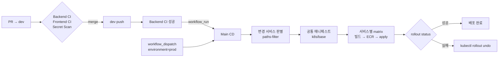

# 배포와 롤백

[프로젝트 소개](../README.md)

## CI/CD · 배포 흐름



### CI — PR과 push에서 도는 검사

| 워크플로 | 검사 |
| --- | --- |
| `backend-ci.yml` | **모듈 경계 규칙** · 프론트/백엔드 설정값 동기화 · k8s ConfigMap 키 참조 검사 · 계약 YAML 파싱(중복 키 금지) · `application*.yml` 중복 키 검사 · Spotless · `./gradlew build`(테스트 포함) · **서비스 4종 Docker 이미지 빌드** |
| `frontend-ci.yml` | 프론트 빌드 |
| `secret-scan.yml` | gitleaks로 전체 히스토리 스캔 |

### 배포 전 설정 검사

설정 누락이나 불일치를 배포 전에 확인하도록 CI와 기동 검사를 추가했다.

| 검사 | 막는 사고 |
| --- | --- |
| 모듈 경계 규칙 (`apps/X-api` → `common` + 자기 도메인만) | 한 서비스의 도메인 코드가 다른 서비스 이미지로 새어 들어감 |
| k8s `configMapKeyRef` 키 존재 검사 | 키 오타는 `kubectl apply`도 통과하고 파드도 뜬다 — 환경변수만 비어 앱이 조용히 기본값으로 동작 |
| 프론트·백엔드 설정값 동기화 (하이라이트 최대 글자 수) | 한쪽만 바뀌면 "다 긁고 메모까지 쓴 뒤 저장 거절" 같은 UX만 조용히 깨짐 |
| `application*.yml` · 계약 YAML **중복 키** 금지 | PyYAML은 중복 키를 덮어써 통과시키지만 Spring(SnakeYAML)은 기동 시 예외 — 실제로 4개 서비스가 동시에 못 떴다 |
| 계약 YAML 파싱 + **파일 건수** 확인 | 경로가 바뀌어 0건이면 검사가 항상 통과한다 |
| CD의 필수 변수 빈 값 가드 | `envsubst`는 빈 값을 넘겨 `${...}` 리터럴이 박힌 매니페스트가 배포된다 |
| 기동 시 `VectorIndexVerifier` | 차원·거리척도가 다른 인덱스로 떠서 검색 결과가 부정확해지는 문제 |
| Terraform apply 전 **IAM 커버리지 대조** (`scripts/check-terraform-iam-coverage.py`) | 권한 하나가 빠지면 apply가 10~20분 리소스를 만들다 중간에 `AccessDenied`로 멈춘다. 배포된 역할의 실제 권한을 읽어 `aws_*` 리소스 타입과 대조 |

**계약 우선 개발**: 서비스 간 API는 `backend/contracts/*.yaml`(OpenAPI 4종)이 단일 원본이다. 프론트 타입은 실서버가 아니라 이 YAML에서 생성하므로, 구현이 계약을 벗어나면 프론트에서 타입 에러로 드러난다.

### CD — `main-cd.yml`

1. **트리거**: `dev` 브랜치에서 Backend/Frontend CI가 **성공**하면 `workflow_run`으로 dev에 자동 배포. **prod는 `workflow_dispatch`(수동)로만** 배포한다.
2. **변경 서비스 판별**: `dorny/paths-filter`로 **이번 push 직전 커밋과만** 비교해 바뀐 서비스만 배포한다. `common`·`contracts`·`build.gradle` 변경은 4개 전부를 깨운다.
3. **공통 매니페스트**(`k8s/base`)를 서비스 배포보다 먼저 **한 번만** 적용한다(네임스페이스, Secret, DB ExternalName, Ingress, NetworkPolicy, PriorityClass, ResourceQuota).
4. **서비스별 matrix**: OIDC로 AWS 역할을 받고 → SSM에서 배포 설정을 읽고(`scripts/load-deployment-config.sh`) → 이미지를 빌드해 ECR에 올리고 → `envsubst`로 매니페스트를 렌더링해 `kubectl apply` → `rollout status`로 대기한다.
5. **실패하면 자동으로 `rollout undo`** 한다.

**설정과 환경 분리**

- dev/prod는 GitHub Environments(`integrated-dev` / `integrated-prod`)로 나누고, AWS가 만드는 값(엔드포인트, IRSA ARN 등)은 **SSM Parameter Store를 단일 원본**으로 읽는다.
- 배포 직전에 클러스터명·네임스페이스·DB 이름이 대상 환경과 맞는지 검증한다 — dev 배포가 prod DB를 가리키면 거기서 멈춘다.
- 필수 변수가 비면 즉시 실패한다. `envsubst`는 빈 값을 조용히 넘겨 `${...}` 리터럴이 박힌 매니페스트를 만들기 때문이다.

**이미지 태그**: `{커밋 SHA 40자리}`(불변) + `main-{run_number}`. ECR은 태그 불변이라, 같은 SHA 이미지가 이미 있으면 재빌드하지 않고 run 태그만 ECR 안에서 재태깅한다. Buildx GHA 캐시를 서비스별 scope로 나눠 쓴다.

**인프라**: Terraform 계층 `00-base → 01-data → 02-runtime`을 `terraform-apply.yml`로 적용한다(`APPLY-{env}` 확인 문자열 필수). 상세는 [Terraform 구성](../terraform/).

---

## 롤백 방법

### 1) 자동 — 배포 실패 시

`main-cd.yml`의 `rollout status`가 1200초 안에 끝나지 않으면 해당 Deployment를 `kubectl rollout undo`로 **직전 ReplicaSet**으로 되돌린다. 서비스별 matrix가 `fail-fast: false`라 한 서비스 실패가 다른 서비스 배포를 막지 않는다.

### 2) 수동 — `Rollback Dev Environment` 워크플로 (dev)

GitHub Actions → **Rollback Dev Environment** → Run workflow

| 입력 | 설명 |
| --- | --- |
| `target_commit_sha` | 되돌릴 **정상 커밋의 40자리 SHA** (`git rev-parse <short-sha>`) — 실제로 배포된 적 있는 커밋이어야 한다 |
| `services` | `all` 또는 `catalog,order,member,ai,frontend` 중 일부 |
| `revert_git` | `true`면 dev 브랜치에 revert 커밋을 만들어 push (히스토리 보존) |
| `deployment_mode` | 기본값 `integrated` 그대로 둔다 (dev/prod가 한 클러스터를 네임스페이스로 나눠 쓰는 현재 구성) |

동작 순서:

1. **입력 검증** — 짧은 SHA는 5초 만에 거절한다(ECR 태그가 full SHA라 `ImagePullBackOff`로 늦게 터지기 때문).
2. **DB 스키마 변경 감지** — 대상 커밋과 현재 dev 사이의 Liquibase changelog diff를 Job Summary에 표로 띄운다.
3. **Git revert** — `git revert -m 1 <target>..HEAD`. 충돌하면 abort하고 배포 롤백은 계속한다.
4. **ECR 이미지 존재 확인** — 대상 SHA 이미지가 없으면 클러스터를 건드리기 전에 멈춘다(CD는 변경된 서비스만 빌드하므로 모든 커밋에 4개 이미지가 다 있지는 않다).
5. 대상 SHA의 매니페스트 + 이미지로 `apply` → `rollout status`. 롤백 자체가 실패하면 `rollout undo`.
6. 프론트엔드는 대상 커밋 소스로 다시 빌드해 S3 동기화 + CloudFront 무효화.

### 3) 긴급 — kubectl 직접 (prod 포함)

```bash
kubectl -n <dev|prod> rollout history deployment/order-deployment
kubectl -n <dev|prod> rollout undo    deployment/order-deployment              # 직전 리비전
kubectl -n <dev|prod> rollout undo    deployment/order-deployment --to-revision=<N>
kubectl -n <dev|prod> rollout status  deployment/order-deployment
# ai 는 Deployment 가 2개다: ai-rag-deployment, ai-bot-deployment
```

### DB는 롤백하지 않는다

Liquibase는 앞으로만 간다. 앱을 되돌려도 스키마는 앞선 상태로 남는다.

| 롤백 구간의 DDL | 옛 코드에서 |
| --- | --- |
| 컬럼 추가 (nullable) / 테이블 추가 | 무해 |
| 컬럼 추가 (**NOT NULL**) | 🔴 옛 코드의 INSERT가 제약 위반 |
| 컬럼 삭제 / 이름 변경 | 🔴 옛 코드가 없는 컬럼을 조회 |

🔴 항목이 섞여 있으면 롤백 대신 **앞으로 고쳐 재배포(roll-forward)** 한다. DB 복원은 되돌릴 수 없는 작업이라 자동화하지 않았다.
