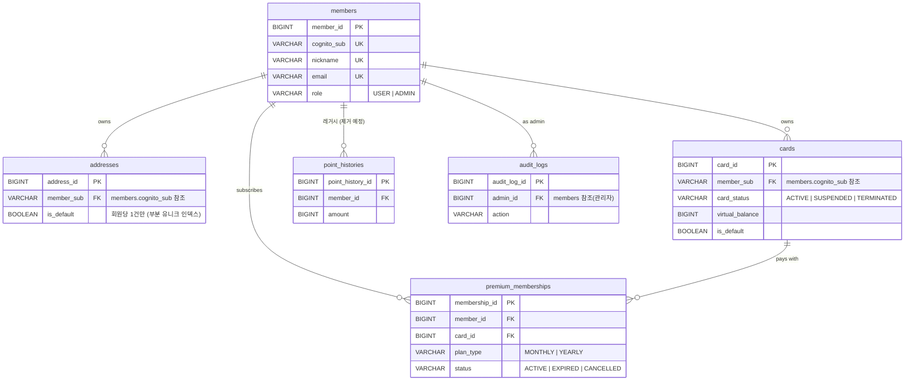
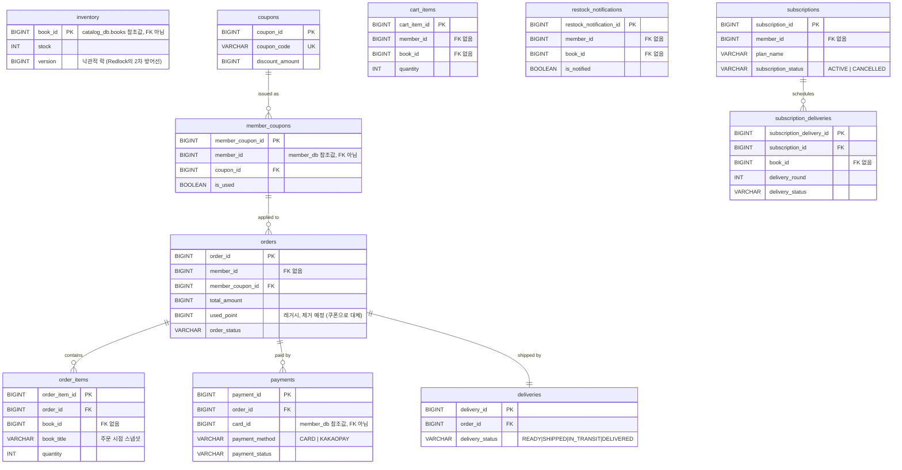
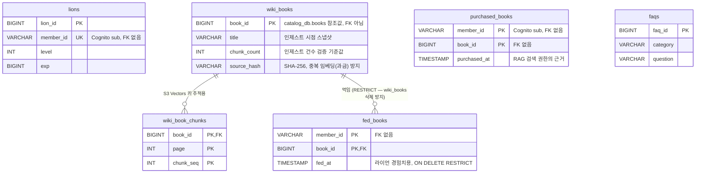

# DB 스키마 ERD v2

> `db/postgres/00-init.sql` ~ `04-ai_db.sql` 실제 DDL 기준으로 다시 그렸습니다. (구버전 ERD는 실제 스키마와 안 맞아 폐기됨 — 아래 "폐기된 설계" 참고)
> Aurora PostgreSQL **클러스터 1개**에 `member_db` / `catalog_db` / `order_db` / `ai_db` **스키마 4개**로 분리되어 있고, 서비스 계정마다 자기 스키마에만 `USAGE` 권한이 있습니다(`00-init.sql`). 그래서 스키마 경계를 넘는 FK는 대부분 **선언돼 있지 않습니다** — 값만 들고 있고 조인하지 않는 게 의도된 설계입니다. 아래 ERD에서 "FK 없음"이라고 써놓은 건 버그가 아니라 이 경계 원칙을 지킨 결과입니다.

---

## member_db

> **`point_histories` — 레거시, 제거 예정.** 포인트 제도는 폐지되고 쿠폰으로 대체하기로 확정됐습니다. 다만 `order_db.orders.used_point` 컬럼이 아직 `total_amount` 계산 체크 제약(`chk_orders_total`)에 살아 있어서, 스키마 정리 시 이 컬럼과 제약도 함께 손봐야 완전히 제거됩니다.

---

## catalog_db

```mermaid
erDiagram
    categories {
        BIGINT category_id PK
        VARCHAR category_name UK
        BIGINT parent_id FK "자기참조"
    }
    books {
        BIGINT book_id PK
        VARCHAR title
        CHAR isbn UK
        BIGINT price
        VARCHAR epub_s3_key "구독 전용 eBook 원본 S3 key (비공개, Presigned URL로만 제공)"
        VARCHAR sale_status "ON_SALE | STOPPED | OUT_OF_STOCK"
    }
    book_webtoons {
        BIGINT webtoon_id PK
        BIGINT book_id FK
        VARCHAR generation_status "PENDING|GENERATING|COMPLETED|FAILED"
        VARCHAR access_level "PUBLIC | PURCHASER | PREMIUM"
        BOOLEAN is_active "도서당 1건만"
    }
    webtoon_cuts {
        BIGINT webtoon_cut_id PK
        BIGINT webtoon_id FK
        INT cut_order
    }
    recent_books {
        BIGINT recent_book_id PK
        VARCHAR member_id "Cognito sub, FK 없음"
        BIGINT book_id FK
    }
    reading_progress {
        BIGINT reading_progress_id PK
        VARCHAR member_sub "Cognito sub, FK 없음"
        BIGINT book_id FK
        TEXT cfi "epub.js 뷰어 위치"
    }
    wishlists {
        BIGINT wishlist_id PK
        VARCHAR member_id "Cognito sub, FK 없음"
        BIGINT book_id FK
    }
    review_permissions {
        VARCHAR member_id PK
        BIGINT order_item_id PK "order_db 참조값, FK 아님"
        BIGINT book_id
        TIMESTAMP used_at "1건당 1리뷰 강제"
    }
    reviews {
        BIGINT review_id PK
        VARCHAR member_id "Cognito sub, FK 없음"
        BIGINT book_id FK
        BIGINT order_item_id "order_db 참조값, FK 아님. review_permissions로 검증"
        SMALLINT rating
    }
    book_swipes {
        BIGINT book_swipe_id PK
        VARCHAR member_id "FK 없음"
        BIGINT book_id FK
        VARCHAR swipe_action "LIKE | SKIP"
    }
    search_history {
        BIGINT search_history_id PK
        VARCHAR member_id
        VARCHAR query_text
    }
    recommendation_exposures {
        BIGINT exposure_id PK
        UUID queue_id
        VARCHAR member_id
        BIGINT book_id FK
        INT position
    }
    restock_alerts {
        BIGINT restock_alert_id PK
        VARCHAR member_id
        BIGINT book_id FK
        VARCHAR status "WAITING|PROCESSING|SENT|FAILED|CANCELLED"
    }
    processed_restock_events {
        VARCHAR event_id PK
        BIGINT book_id
    }
    product_inquiries {
        BIGINT inquiry_id PK
        BIGINT book_id FK
        VARCHAR member_id "FK 없음"
        VARCHAR status "WAITING | ANSWERED"
        TEXT answer
        VARCHAR answered_by "관리자 Cognito sub"
    }
    faqs {
        BIGINT faq_id PK
        VARCHAR category
        VARCHAR question
    }

    categories ||--o{ categories : "parent_id"
    books ||--o{ book_webtoons : has
    book_webtoons ||--o{ webtoon_cuts : has
    books ||--o{ recent_books : "viewed in"
    books ||--o{ reading_progress : "read in"
    books ||--o{ wishlists : "wished in"
    books ||--o{ reviews : "reviewed in"
    books ||--o{ book_swipes : "swiped in"
    books ||--o{ recommendation_exposures : "exposed in"
    books ||--o{ restock_alerts : "requested in"
    books ||--o{ product_inquiries : "asked in"
```

> **`product_inquiries`는 "상품 문의 게시판"이지, 기획서의 "1:1 실시간 문의채팅"이 아닙니다.** `answer`/`answered_by` 컬럼이 있어 관리자가 실제로 답변할 수 있는 건 이쪽입니다. 실시간 채팅(WebSocket)은 `ai_db` 쪽을 보세요 — 그쪽은 답변 저장 테이블이 아예 없습니다.
> `search_history`, `processed_restock_events`(이벤트 dedup용, 소비 성공 여부 idempotency 체크), `faqs`는 다른 테이블과 관계가 없는 독립 테이블입니다.

---

## order_db

> **정기구독은 실제로 두 가지입니다.** `member_db.premium_memberships`(eBook 무제한 열람 + 사자 RAG + 4컷 요약, 월/연 결제)와 `order_db.subscriptions`+`subscription_deliveries`(실물 도서 정기배송)는 완전히 별개 테이블입니다. 기획서/요구사항서가 "정기구독"이라고 뭉뚱그려 쓴 걸 문서에서도 구분해서 써야 헷갈리지 않습니다.
> `inventory`가 재고를 갖고 있고(`catalog_db.books`에는 재고 컬럼이 없음), 재고 차감·Redlock·결제가 전부 이 스키마 안에서 로컬 트랜잭션으로 끝납니다 — MSA인데도 재고 관련 Saga/보상 트랜잭션이 필요 없는 이유입니다.

---

## ai_db

> **벡터는 이 스키마에 없습니다.** S3 Vectors에 **인덱스가 2개** 있습니다 — RAG/EPUB 질의용 `wiki-v1`과, 추천용 `recommendation-books-v1`(별도 파이프라인, `이벤트-메시징-명세.md` 참고). `wiki_books`/`wiki_book_chunks`는 `wiki-v1` 인덱스가 무엇을 담고 있는지 추적하는 메타데이터일 뿐입니다.
> **검색 권한은 `fed_books`가 아니라 `purchased_books`가 갖습니다** — 사자를 안 키워도 산 책은 읽혀야 하고, 먹였다고 안 산 책이 읽히면 안 되기 때문입니다(코드 주석 근거).
> **`inquiries` 테이블은 의도적으로 없습니다.** 1:1 실시간 문의채팅(WebSocket)은 만들어져 있지만, 답변을 보관하고 관리자가 여는 화면이 끝내 안 만들어져서 — 문의를 받아만 두고 아무도 못 보는 상태였습니다. 그래서 이 스키마는 문의 자체를 저장하지 않기로 했습니다. **기획서의 "관리자가 1:1 채팅으로 실시간 응대"는 현재 미구현/보류 상태**이며, 상담이 필요한 문의는 `catalog_db.product_inquiries`(게시판형, 관리자 답변 가능) 쪽으로 안내됩니다. `faqs` 테이블은 `catalog_db.faqs`와 별개로, AI 봇 1차 응대용 지식베이스입니다.
> `catalog_db`와 `ai_db` 양쪽에 `faqs` 테이블이 있는 건 중복 실수가 아니라 — 하나는 사람이 보는 상품 FAQ 게시판, 하나는 AI 봇이 참조하는 응답 근거로 용도가 다릅니다.

---

## 폐기된 설계

이전 버전 ERD에 있던 "중고서적 마켓플레이스 스키마"(`used_books`, `chat_rooms`, `chat_messages`, `used_book_payments`, `settlements`)는 실제 DB 어디에도 없습니다. 요구사항정의서 v2가 "1:1 문의 채팅 *(신규 — 중고거래 대체)*"라고 명시한 대로, 중고거래 기능은 문의채팅으로 완전히 대체되어 폐기된 것으로 확인됩니다.
